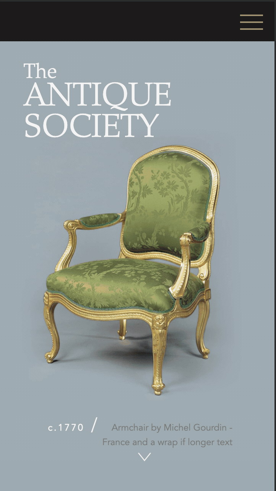
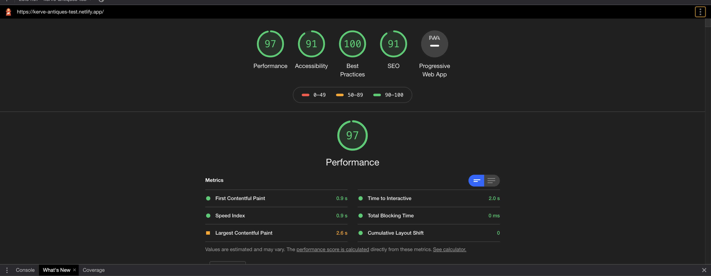

# The Antique Society - A Tech Test for Kerve

## A fully responsive animated website built with plain HTML, CSS/SASS, and vanilla JavaScript. 

## The Brief

- Build a website to match the mobile and desktop Photoshop designs provided
- Use flat HTML, CSS/SASS and JavaScript
- Make it work on all screen sizes
- Add CSS/JS animations 

## Responsive Design 

- Responsive to 4 key brekpoints covering screens from small mobile to large screen
- Use of SASS mixins for responsive design 

### Adaptations to the design

- Navigation items overlapped on small desktop/large iPad so I have added a subnavigation dropdown menu which animates with CSS transform and hover effects 

## CSS and JavaScript Animations 

### Navigation Smooth-Scroll and Hover effects 
- Click on 'Events' or 'About us' to navigate smoothly to each section
- Animated hamburger SVG and navigation drawer 
- Hover highlight effect and drop down sub-navigation

### Hero Animations
- Hero parallax effect 
- Uses JavaScript to resize the hero image on scroll
- CSS Keyframe animation for drop-in effect on letters
- Main title opacity fades in
- Mobile arrow animates incrementally and navigates smoothly to next section on click

### Event section animations
- Event items animate in smoothly on scroll using JavaScript scroll event
- Button hover CSS effect

## Performance 
### Above 90 for performance, SEO, Best Practices, and Accessiblity 

- Ran images through image compression to improve page load speed
- With more time I would add aria-labels and test on screen reader 

## Cross-browser Compatability 
- Tested and works consistently on Edge, Chrome, and Safari
- Fixed smooth scroll bug on IOS by adding smooth scroll polyfill 

## With more time I would...

- Add aria-labels for higher accessibility score and test on screen reader 
- Add a lazy load component for images 
- Parallax effect disabled on IOS only due to z-index behaving differently with other animations: Would try and find a solution to make this work

