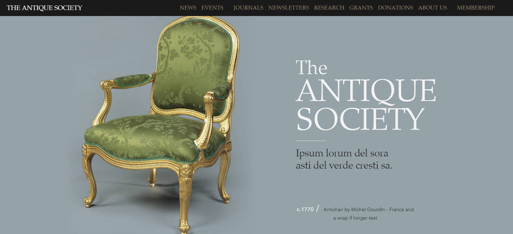

# The Antique Society - A Tech test for Kerve

## iOS example video

](https://youtu.be/euDac7qTe84)

This is a fully responsive website built with plain HTML, CSS/SASS, and vanilla JavaScript as a tech test for Kerve. 

## The Brief

- Build a website that matched the designs provided for mobile and desktop
- Use flat HTML, CSS/SASS and JavaScript
- Make it work on all screen sizes
- Add CSS/JS animations 

## Responsive Design 

- Responsive to 4 key brekpoints covering screens from small mobile to large screen
- Concise media query breakpoints with sass mixins

### Adaptations to the design
- Navigation items did not fit a small desktop/large iPad so I added a subnavigation dropdown menu that animated with CSS transform

## CSS and JavaScript Animations 

- Hero image parallax effect 
- Text hover highlight navigation items 
- Button hover effect on event items 

### CSS Keyframe animations
- Small white down arrow on mobile moves up and down every few seconds
- Hero letter drop-in animation 
- Hero title opacity fade in 

### JavaScript Scroll & onClick Events
- Click down arrow on mobile to navigate smoothly to next section
- Event card items fly in from the bottom on scroll 
- Hero image zooms on scroll 

## Cross-browser Compatability 
- Tested and works consistently on Edge, Chrome, and Sarafi
- Fixed smooth scroll bug on IOS by adding smooth scroll polyfill 

## Performance 
### Excellent performance, SEO, and Accessiblity 

- Ran images through image compression to improve page load speed
- With more time I would add aria-labels and test on screen reader 

